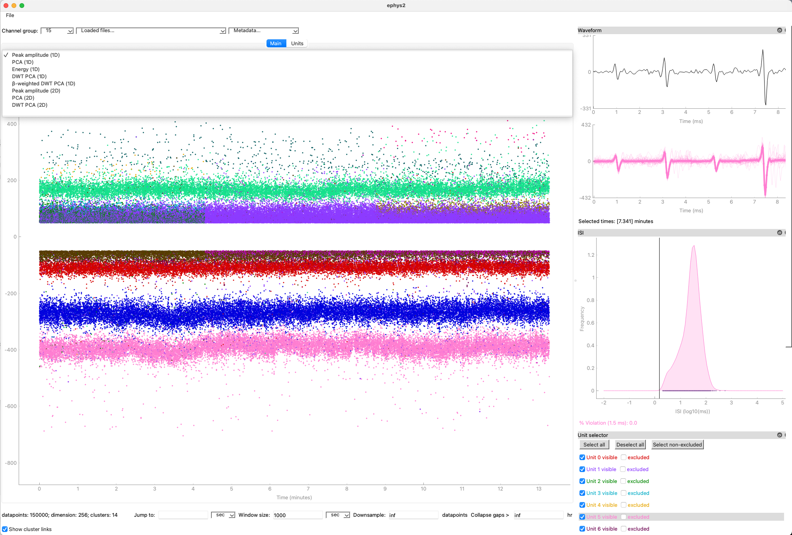
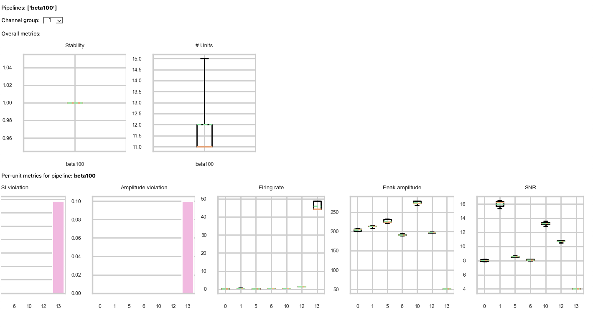
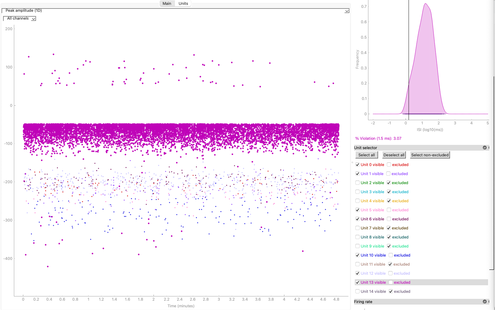

=============
Using the GUI
=============

.. _install_gui:

Install the GUI on user workstation
===================================
First, follow the instructions to :ref:`install_nompi` if you haven't already. 

From the same folder, run 

.. code-block:: console

	$ pip install -r gui-requirements.txt 

.. note::
	If ``PyQT6`` fails to install on your system during this process, you can replace it in ``gui-requirements.txt`` with ``PySide6`` or ``PyQT5`` instead.

.. _use_gui:

Then, run the GUI using 

.. code-block:: console:

	$ python -m ephys2.gui

Overview
========

The ``ephys2`` GUI is a cross-platform Qt application which serves as a viewer (and in some cases editor) for any HDF5 file produced by a pipeline. In addition, it can open:

* Intan RHD2000 files
* Intan one-file-per-signal type data
* ``ephys2`` benchmark JSON files

The GUI operates on very large datasets by loading only portions of data into memory. This allows one to inspect & edit datasets by scrubbing in time:

In the above spike-sorted dataset, the view consists of:

#. A primary view containing selectable 1- or 2-dimensional embedding of waveforms, with feature transforms reflecting similar options available in the spike-sorting pipeline itself
#. Auxiliary views, such as the individual and class-average waveforms, log-space ISI distribution, and cross-correlation
#. Unit selector for excluding units from the dataset or excluding from view

Manual curation using the GUI
=============================

Viewing data in different feature spaces
----------------------------------------
Units close to the noise floor can make manual curation using peak-amplitude views difficult. Using other 1-dimensional projections such as PCA can help identify continuity:

.. card-carousel:: 3

	.. card:: Peak amplitude
		:width: 75%

		.. image:: images/curation_amp.png

	.. card:: 1st principal component
		:width: 75%

		.. image:: images/curation_pca.png

Using summarization for long-term recordings
--------------------------------------------

Long-term recordings (on the scale of multiple hours or more) will result in very slow GUI performance if viewed in entirety, especially over network drives.

Instead, use the ``label.summarize`` stage (see :doc:`built_stages/index`) in your pipeline to add a down-sampled view. Using 2-dimensional projections in this view can make the curation process (linking incorrectly split units) significantly faster, due to the denoising effect of the downsampling:

.. card-carousel:: 2

	.. card:: 140 hour summary, peak amplitude (1D)
		:width: 75%

		.. image:: images/long_summary.png

	.. card:: 140 hour summary, wavelet PCA (2D)
		:width: 75%

		.. image:: images/long_summary_pca.png

(The bottom unit in the 1d view corresponds to the large bottom-right cluster in the 2d view, whose spread shows the effect of drift.)

* This preserves statistical properties such as the ISI distribution and within-class variance, using subsampling. 
* Tabs at the top allow for switching between summarized and detailed views, giving coarse- and fine-grained views in time

Using quality metrics to reject units
-------------------------------------

``ephys2`` can compute quality metrics without a ground truth, using the ``benchmark.intrinsic`` stage (see :doc:`built_stages/index`). Adding this stage will produce a ``JSON`` file containing per-tetrode & per-unit metrics which can be opened by the GUI:

Used in conjunction with the waveform view, units can be rejected with visual inspection. For example **unit 13** has low SNR, low peak amplitude, and high ISI violations and can be rejected:

