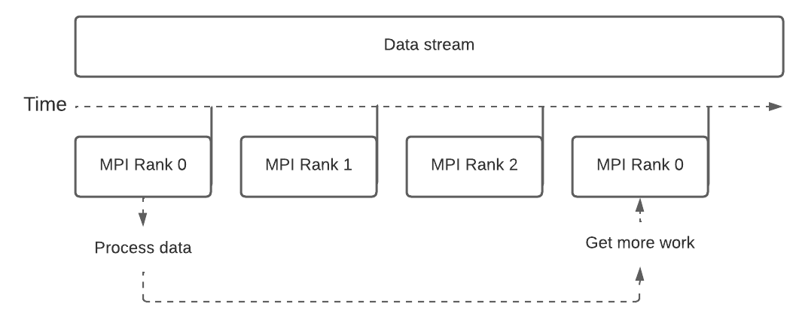
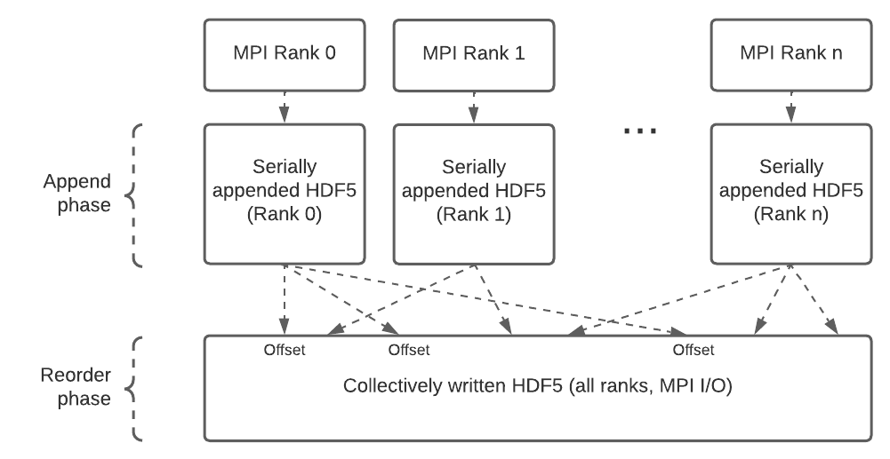

========
Overview
========

``ephys2`` handles the conversion of data from raw electrode recordings to labeled spikes through the declaration of :doc:`pipelines`.

:doc:`pipelines` are linear sequences of :doc:`processing_stages` which describe the data conversion process.

Execution of pipelines consist of two alternating phases, :ref:`Evaluation` and :ref:`Checkpoints`.

Data
====

``ephys2`` makes the fundamental assumption that all data structures passing through the pipeline are parametrized by **time** (that is, they are one- or multi-dimensional time-series). 

The type definitions for time series used as inputs and outputs of `ephys2` pipelines can be seen in :doc:`data_structures`.

Evaluation
==========

``ephys2`` handles the automatic distribution of work on a multicore machine using the `Message Passing Interface (MPI) <https://www.open-mpi.org/>`_. 

As all data structures are time-series, they are split at user-defined sizes into "batches" along the time axis, and assigned to parallel workers using **round-robin**:

|
Each parallel worker (aka MPI ``rank``) will apply all the user-defined processing stages until a  ``checkpoint`` is reached.

Checkpoints
===========

A ``checkpoint`` is the general data-persistence mechanism used by ``ephys2``. It is mainly used for two purposes:

* Save data at any point in the pipeline
* Turn a stream of non-deterministically sized batches (e.g. spikes in a particular time-interval) into a stream of deterministically sized batches (e.g. for the clustering step)

This is accomplished in a scalable manner using `Parallel HDF5 <https://docs.h5py.org/en/stable/mpi.html>`_, which uses `MPI I/O <https://wgropp.cs.illinois.edu/courses/cs598-s16/lectures/lecture32.pdf>`_ underneath. It is well-suited to parallel filesystems used in HPC environments such as `Lustre <https://www.lustre.org/>`_.

As batches are not guaranteed to have a particular size at any point in the pipeline, parallel serialization is achieved using a two-step process:

|
#. First, each rank's individually processed batches are saved to an HDF5 file whose `time` axis is resizable, along with the size of each batch. This is also known as "one-file-per-process".
#. Next, the sizes of each batch are used to calculate `offsets` in the final output file. Each rank's batches are written at these offsets in parallel using HDF5's MPI I/O driver.