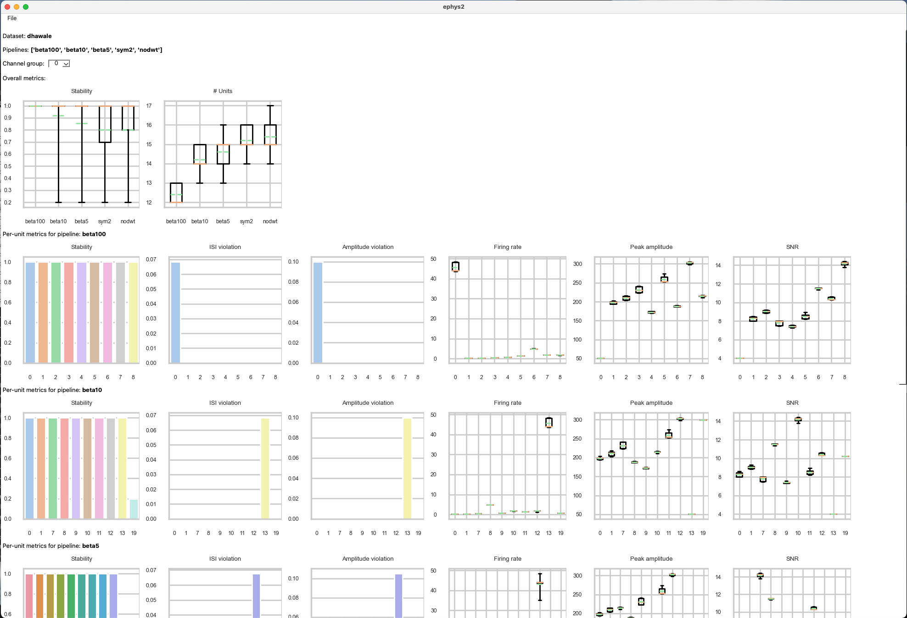

===================================
Improving spike-sorting performance
===================================

Empirically, the specific characteristics of combined noise and background activity have the largest impact on spike-sorting performance. In particular, units whose SNR is low or varies over time can exhibit a temporally unstable clustering.

Thus, the optimal parameter choice depends strongly on the recording, and in general there is "no free lunch." The example below shows how different tetrodes in the same recording show varying levels of unit stability and separation:

.. card-carousel:: 3

	.. card:: Tetrode 0
		:width: 75%

		.. image:: images/short_tetr_0.png

	.. card:: Tetrode 1
		:width: 75%

		.. image:: images/short_tetr_1.png

	.. card:: Tetrode 15
		:width: 75%

		.. image:: images/short_tetr_15.png
|

Improving cluster stability
===========================

Noise has a smoothing effect on otherwise multimodal distributions in the feature-space. Since ``ephys2`` relies on segmentation fusion to track units over time, this requires a highly stable clustering; otherwise units can drop in and out of noise clusters easily and require operators to manually un-link units.

To address this, ``ephys2`` provides several feature transforms which can improve the separability of units from noise, and can be applied regardless of the clustering algorithm used (see :doc:`built_stages/index`).

Wavelet denoising
-----------------

To separate units from noise, we assume that action potentials are more `sparsely represented in some basis <https://wavelet-tour.github.io/files/05-Ch01-P374370.pdf>`_ than the noise. Thus, the energy of the signal should be concentrated in relatively few coefficients, improving separability using directions of maximal variance (PCA).

``ephys2`` provides an optional denoising discrete wavelet transform, with simply discards detail coefficients and results in a very mild denoising:

.. card:: Wavelet-denoised waveforms

	.. image:: images/wv_denoise.png

Center-weighted spikes
----------------------

Direct attenuation of noise can be achieved by further biasing the representation towards the center of the waveform. ``ephys2`` provides a feature transform applying this bias via an elementwise `Beta distribution <https://en.wikipedia.org/wiki/Beta_distribution>`_ multiplication.

Below are distributions for several values of beta, showing the interpolation between a uniform distribution and the Dirac delta. Alongside, its effect on the denoised waveform:

.. card-carousel:: 2

	.. card:: Symmetric beta distribution, 1-100
		:width: 75%

		.. image:: images/beta.png

	.. card:: Beta-weighted, wavelet-denoised waveforms
		:width: 75%

		.. image:: images/beta_wv_denoise.png

Example -- short session
------------------------

In the following tetrode from a 3-hour session: 

* PCA alone fails to separate units
* PCA in the truncated wavelet basis performs much better
* Applying the center-weighting transform improves separation further, and recovers another unit from the noise cluster

.. card-carousel:: 3

	.. card:: PCA 
		:width: 75%

		.. image:: images/short_pca.png

	.. card:: Wavelet-denoised PCA
		:width: 75%

		.. image:: images/short_pca_dwt.png

	.. card:: Wavelet-denoised PCA + center weighted transform, beta=100
		:width: 75%

		.. image:: images/short_pca_dwt_beta100.png
	
Example -- long session
-----------------------

In the following tetrode from a 420-hour session, a unit drifts toward the detection threshold / noise floor. 

.. card-carousel:: 2

	.. card:: Losing unit to noise (DWT PCA, isocut=0.8)
		:width: 75%

		.. image:: images/long_noise_failure.png

	.. card:: Recover unit from noise (DWT PCA, beta=120, isocut=1.0)
		:width: 75%

		.. image:: images/long_noise_success.png

Comparing the two results, 

#. Wavelet-denoised PCA clusters the unit into the noise at 130 hours, and fails to recover it
#. Applying a center-weighted transform with Beta=120 improves cluster separation, which both prevents mis-clustering into noise, and allows us to use a less aggressive clustering threshold (``isocut=1.0``), which further improves the unit stability

Using feature transforms vs. lowering the clustering threshold
--------------------------------------------------------------

When mis-clustering occurs, particularly near noise clusters, a straightforward solution is to tune nonparametric clustering algorithms to bias towards over-clustering, e.g.:

* ``temperature`` in ``SPC``
* ``isocut_threshold`` in ``ISO_SPLIT``

However, if the cluster partitions are highly sensitive to these parameters (due to lack of separability in the feature-space), it is additionally likely to be unstable over time. While not as much of a problem for short-term recordings which are typically clustered all at once, it is highly problematic for ``ephys2``'s segmentation-fusion based approach, since it results on one of two types of errors which must be manually fixed:

#. Two or more units become one, and they are incorrectly linked
#. One unit becomes two or more, and they are not linked when they should be

These assignment issues arise from the constraint we impose on segmentation fusion that cluster links can only be one-to-one across neighboring partitions (which correctly shifts the burden of clustering to the clustering algorithm).

Thus, improving cluster separation using different feature spaces, when possible, is a better solution than finely tuning the clustering algorithm to attempt to discover the correct clustering in the original space. Ideally, the spike-sorting result is mostly insensitive to the hyperparameter(s) of any nonparametric clustering approach used.

Improving pipeline parameters using the GUI
===========================================

Experimenting with feature transforms
-------------------------------------

As mentioned in :doc:`gui`, viewing data locally in time using different feature transforms can aid in manual curation. However, it can also be used to determine better pipeline parameters, which can eliminate a lot of curation effort. The same feature transforms available in clustering are also available in the GUI.

In :ref:`Example -- long session`, we determined the value of ``beta`` using the following steps:

#. Identify windows of mis-clustering in the coarse-grained view
#. Load raw data in these windows using the fine-grained view
#. Experiment with different 2D embeddings
#. Update our pipeline with the optimal parameters

.. card-carousel:: 2

	.. card:: Summarized view (units initially close to noise)
		:width: 75%

		.. image:: images/long_noise_success.png

	.. card:: Detailed 1D view (units are close to detection threshold)
		:width: 75%

		.. image:: images/detail_1.png

	.. card:: Detailed 2D view (wavelet PCA alone cannot separate)
		:width: 75%

		.. image:: images/detail_2.png

	.. card:: Detailed 2D view (beta=10 improving separation)
		:width: 75%

		.. image:: images/detail_3.png

	.. card:: Detailed 2D view (beta=120 shows high separation)
		:width: 75%

		.. image:: images/detail_4.png
|

Comparing quality metrics across pipelines
------------------------------------------

Standard quality metrics, with or without ground-truth, can be computed for any pipeline using ``benchmark.extrinsic`` or ``benchmark.intrinsic`` respectively (see :doc:`built_stages/index`).

These can be computed for multiple pipelines on the same dataset, and be loaded all at once in the GUI to do cross-pipeline comparisons:

Just select ``File... Open Ephys2 benchmark JSON`` and use ``Shift+Select`` to select multiple files to load. Currently, quality metrics include:

* stability (presence ratio)
* % ISI violation
* % amplitude violation
* firing rate
* peak amplitude 
* SNR

per-unit, per-tetrode.

Automatic curation
==================

Coming soon